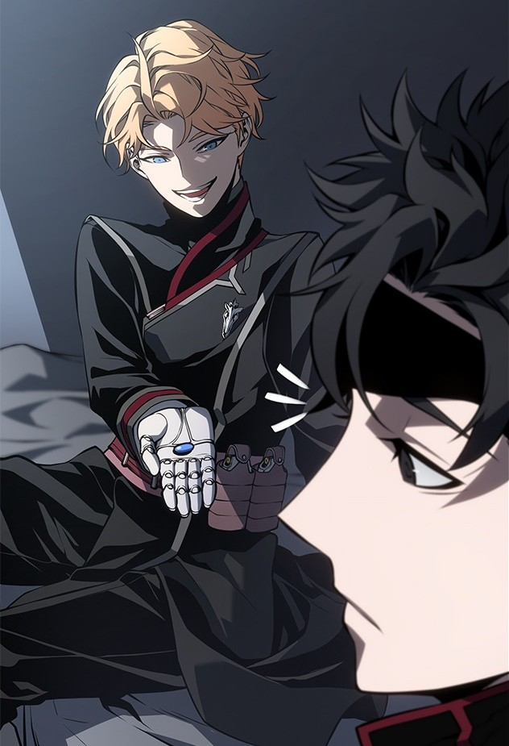

*A spoiler-light companion to Part 1 of our recap, and why this cold, mechanical world gets under your skin.*

Bad Born Blood opens with a performance. The Imperial Guard's cadets are showing their skills to His Majesty, and
one of them, Luca, is sent out against five death-row convicts in cheap cybernetics. Winning was never in doubt.
Standing out is the hard part, so he pulls off a bullet technique that isn't even on the curriculum. He learned it by watching
the noble cadet who went before him.

The Captain of the Guard is so pleased that he takes Luca's eye as a gift. Luca doesn't flinch. His only request is
that the replacement come with a ballistic predictor.

That's the series in one scene.

*Bad Born Blood, episode 1. Art: D-Park / REDICE Studio, Naver Webtoon.*

## A world that swaps flesh for machines

The setting is far in the future. War wrecked Earth, an unknown alien civilization finished the job, and the
survivors drifted until they found a new home called Novus. One of its powers is the Accretia Empire, whose army
trades bodies for machinery. Resources are short even there, and another war is coming.

The Empire builds its soldiers out of children. Luca is number thirty-two: a lower-city orphan who left the slums
at fifteen, from orphanage number seventy-two, in a Guard full of nobles and orphans from the single-digit homes. He has no
family to catch him if he falls, so he lives by a creed: never doubt the Empire, praise the Emperor, and never fall again.

The Empire's own rule is colder still: protect the head and the chest, and everything else is a spare part.

## The noble who wants to be his friend

Ilay Kartika is everything Luca isn't. He's the heir of a famous noble house, ranked second behind Luca at the
range, and he keeps saying things that sound dangerously like criticism of the Empire. He also has a dream nobody
in his family of generals would approve of: studying the Arcane civilization, which the Empire bans private
research into.

Luca tells him to leave. Ilay keeps coming back.

*Bad Born Blood, episode 1. Art: D-Park / REDICE Studio, Naver Webtoon.*

## A first battle, and a teacher who explains nothing

In their second year, the two lead platoons against an outpost of Cora, a rival power descended from the same
lost Earth. The order is to kill every prisoner. What Luca finds inside isn't what he was told to expect, and what
he does next is the first crack in that creed.

Then comes Kinuan, who teaches a fighting art that is hard to learn and damages the brain of whoever uses it. He
explains nothing. He takes Luca back to the lower district he swore never to return to, makes him swap to a weak arm
and leg, and walks him into an arena. The lesson is simple: adapt to what you're given.

Where that leads, and what the Empire eventually wants from him, is where the video takes over.

## Watch it

Part 1 covers episodes 1 to 48 in one sitting, with living-panel effects, original narration and chapters for
every arc.

- ▶️ **Bad Born Blood Part 1:** https://youtu.be/3tKzjxZP9rM

---

**Support the original.** *Bad Born Blood* is drawn by D-Park, with story by Jinuri (지누리), adaptation by
Ho Bak-sae (호박새), based on the novel by Baeksu Noble (백수귀족), and produced by REDICE Studio. Read it officially
on WEBTOON: https://www.webtoons.com/en/action/bad-born-blood/list?title_no=7208

*Bedtime Manhwa makes fan recaps with original narration. All artwork belongs to its creators. Please support the
official release.*
