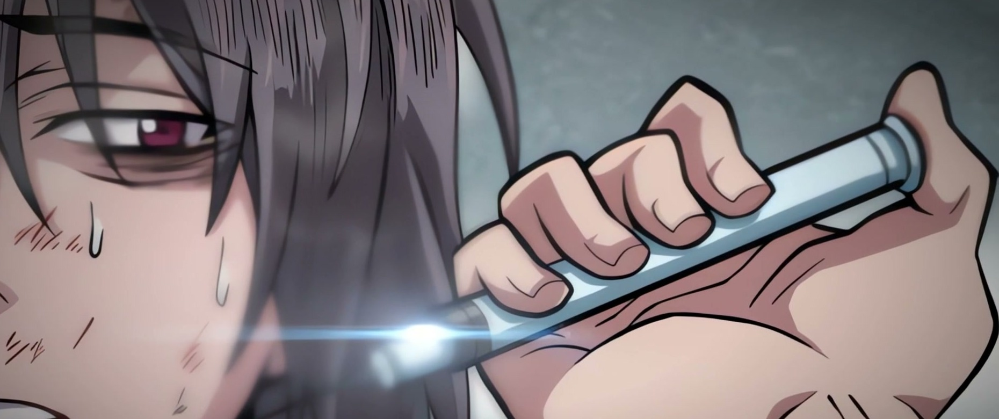
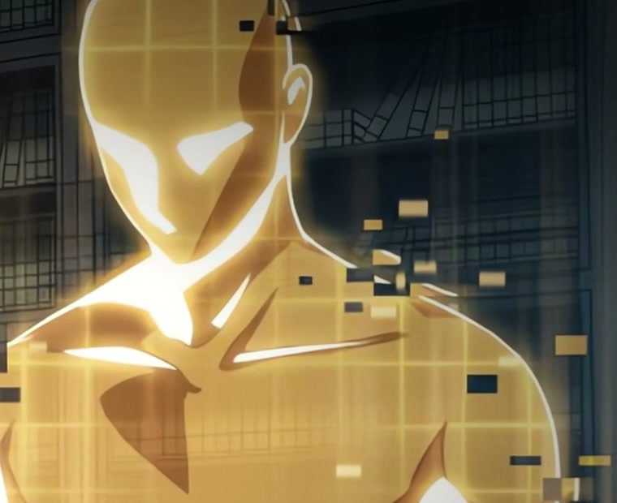

*A spoiler-light companion to Part 1 of our recap, and a look at why this opening stretch is so easy to binge.*

Cheon Yeo-woon is the Demonic Cult's seventh heir and its least wanted one. Every other heir has a mother from one of
the Cult's six great sects. His doesn't. He has no martial arts and no allies.
When the story opens, he's running through the Hundred Thousand Mountains at night with assassins behind him, and
it ends the way you'd expect: with a sword through his gut.

Then a boy in a hoodie steps out of the smoke, crackling with lightning. He tears through the assassins, jabs a syringe
into Yeo-woon's arm and vanishes. A calm voice starts up inside Yeo-woon's head: *seventh generation Nano Machine,
beginning operation.*

*Nano Machine, episode 1. Art: Geumganbulgoe / Naver Webtoon.*

## A cheat code that never shuts up

Nano is billions of tiny machines living in his body. They rebuild it, copy any technique he watches, and talk to
him constantly. Yeo-woon has never heard the word "machine", and it sounds just like *Ma-shin*, the Demon God his Cult
worships, so his first move is to hit the floor and start bowing. A lot of the fun of Part 1 is this double act: a
cornered, furious fifteen-year-old and a deadpan machine from the future that treats every crisis as a technical
problem. At the first academy test, Nano solves a deadly lute attack by switching off his hearing. Then, to make his
survival look believable, it has him cough up blood on cue. Realism, Nano explains, was the priority.

## The academy and the library

The Cult's academy is four years and six stages, with one attempt at each test, and failing means you're out on the
spot. The other heirs have trained since the cradle, and Yeo-woon was made to swear off martial arts until the day he
arrived. What evens the odds is the library. Most students memorise a couple of manuals in their two hours; with Nano
scanning, he gets through a hundred and fifty-six in a single visit. On the first floor he also finds a stone tablet carved by the Cult's founder, the
Founding Heavenly Demon. Nobody has looked at it in over twenty years, and it hides more than a poem.

*Nano Machine, episode 28. Art: Geumganbulgoe / Naver Webtoon.*

## Not just a power fantasy

Under the jokes there's a real grudge. Yeo-woon's mother, Lady Hwa, died of poisoned food five years before the
story starts, and he has been hunting the source of that poison ever since. The trail runs through the six sects,
and every answer he gets opens a worse question. The academy's headmaster gives him the advice that frames the
whole part: keep your heart hot and your head cold.

By episode 60, the boy nobody wanted leads fifty-three students, the biggest force in the academy, and three great
sects want him gone. At the top of the Cult, his father is watching.

## Watch it

Part 1 covers episodes 1 to 60 in about 69 minutes, with living-panel effects, a narrator who can't resist a joke, and
chapters for every arc.

- ▶️ **Nano Machine Part 1:** https://youtu.be/l8Xh04jlsMg
- **Part 2 (episodes 61–120) is coming soon.** Subscribe on YouTube so you don't miss it.

---

**Support the original.** *Nano Machine* is adapted by Hyeonjeolmu (현절무), drawn by Geumganbulgoe (금강불괴), and
based on the novel by Hanjungwolya (한중월야). Read it officially on Naver Webtoon:
https://comic.naver.com/webtoon/list?titleId=747271

*Bedtime Manhwa makes fan recaps with original narration. All artwork belongs to its creators. Please support the
official release.*
